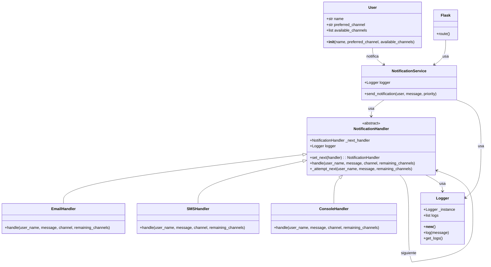

# 🔔 Multichannel Notification System (REST API)
**Author**: Melissa Forero Narváez

This project implements a multichannel notification system using a REST API built with Flask. It follows two design patterns: 
Chain of Responsibility and Singleton. The system is designed to deliver messages to users through their preferred communication channel, and if that fails, it continues attempting delivery through the remaining registered channels.
When a notification is sent, the system attempts to deliver the message in order of preference. 
Delivery failures are simulated using random.choice([True, False]), and each attempt is logged using a dedicated Logger.

---

## 📌 Design Patterns Used

### 1. **Chain of Responsability**
The Chain of Responsibility pattern is used to manage the delivery of notifications through multiple channels. Each channel (email, SMS, console) 
is implemented as a concrete handler that inherits from the abstract class NotificationHandler.

Each handler:

- Checks whether it is responsible for the current notification channel.

- Attempts to send the message using that channel.

- If the attempt fails (simulated with random.choice([True, False])), it delegates the task to the next handler in the chain using the set_next() and _attempt_next() methods.

### 2. **Singleton**
The Singleton pattern is applied to the Logger class, which ensures that all parts of the application share the same instance of the logger. 
This guarantees consistent logging behavior and avoids duplication of log states across handlers.
The logger:

- Implements the __new__ method to control instance creation.

- Stores log entries in a centralized logs list.

- Provides timestamped log entries for each notification attempt.

- Allows logs to be retrieved or printed to the console.

---

## 🧩 Class Diagram

---

## ⚙️ Setup
### 1. Clone the repository

   ```bash
   git clone https://github.com/SwEng2-2025i/LM18h.git
   cd Laboratory1/1010246297/app 
   ```

### 2. Create and activate a virtual enviroment:

   ```bash
   python -m venv venv
   source venv/bin/activate   # Linux/Mac
   venv\Scripts\activate      # Windows
   ```

### 3. Install dependencies:

   ```bash
   cd ..
   pip install -r requirements.txt
   ```

### 4. Run the API:

   ```bash
   python app/main.py
   ```

---


## 🔧 API Endpoints
| Method | Endpoint              | Description                                      |
|--------|-----------------------|--------------------------------------------------|
| POST   | `/users`              | Register a user with name, preferred and available channels |
| GET    | `/users`              | List all users                                   |
| POST   | `/notifications/send` | Send a notification with message and priority    |

---

## 📄 API Endpoints Documentation
After running the server, you can access the Swagger UI here: http://localhost:5000/apidocs 

---


## 🧪 Testing
You can use the example cURL commands listed above to test the API endpoints.
### POST `/users`
``` bash
curl -X POST http://localhost:5000/users \
-H "Content-Type: application/json" \
-d '{
  "name": "Juan",
  "preferred_channel": "email",
  "available_channels": ["email", "sms"]
}'
```
### GET `/users`
``` bash
curl -X GET http://localhost:5000/users
```
### POST `/notifications/send`
``` bash
curl -X POST http://localhost:5000/notifications/send \
 -H "Content-Type: application/json" \
 -d '{
   "user_name": "Juan", 
   "message": "Tu cita es mañana", 
   "priority": "alta"
}'
```